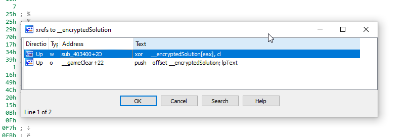
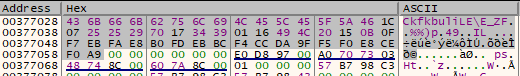

Based on the name and starting the game, we're working with an FPS game


Walking around we see a bunch of potatos, a big ball in the middle


and a picture on a billboard


We can shoot the potatos, and they'll eventually die.  Finally, when you bump into any of the potatos you'll take 2 points of damage until you eventually die


Looking back at the rest of the files the application came with and the game assets


The solution is most likely gained by playing the game.  Opening FPS.exe in IDA and looking at the strings, we see both a Game Over! You are dead and a Game Clear!


Looking at the XREFs for Game Clear! we're taken to a function sub_4039c0


Reviewing this function, we see that a string is passed to MessageBoxA.  But its jumbled


This is most likely our solution, so we'll mark it as __encryptedSolution and we'll name this function, __gameClear


Now that we've made things a bit easier to read, lets go back and look at all the XREFs for __encryptedSolution and see if we can find where the decryption routine is



Looks like we found our decryption routine


This function, is a relatively simple function.

  1. We push ECX and read it in with a function call (sub_403440)
  2. Check to see if -1 is returned, if it is we jump to the end of the function
  3. Otherwise, we move the value returned into ECX and multiply it with 210h
  4. This [value + dword_409190] is loaded into EDX and checked to see if its greater than 0
  5. if it is, we add -2 to this value and replace it
  6. If the jump is not taken, we XOR __encryptionSolution

Time to open a debugger and breakpoint on the PUSH ECX 


Shooting one of the potatos, we hit the breakpoint.  Tracing through, we see that each potato has an associated value and this value is loaded into EAX (returned by fps.373440)


Tracing further down


The value at ECX+379190 is 64h and is loaded into EDX

More tracing


We see that -2 was added to 64h which is 62h and that value overwrites the previous 64h and we exit the function.  Shooting the same potato, we go back through this loop again.  So we can assume this value is the HP of the potato.  Once potato dies, the test edx, edx will fail and we'll drop down into the XOR function.

Let's look at our encrypted string in memory



Lets try killing all the potatos and see if anything happens to our string.  To save clicks, I patched the add edx, fffffffe to add edx, ffffff9a to instantly kill the potatos


Killing all the potatos returns this string


We have our solution, but it looks like 2 potatos are missing.  Luckily for us, its just XOR so we can XOR the decrypted and encrypted strings and see if we see any kind of pattern

fps.py
```
#!/usr/bin/python3

before = [ 0x43, 0x6B, 0x66, 0x6B, 0x62, 0x75, 0x6C, 0x69, 0x4C, 0x45,
  0x5C, 0x45, 0x5F, 0x5A, 0x46, 0x1C, 0x07, 0x25, 0x25, 0x29,
  0x70, 0x17, 0x34, 0x39, 0x01, 0x16, 0x49, 0x4C, 0x20, 0x15,
  0x0B, 0x0F, 0xF7, 0xEB, 0xFA, 0xE8, 0xB0, 0xFD, 0xEB, 0xBC,
  0xF4, 0xCC, 0xDA, 0x9F, 0xF5, 0xF0, 0xE8, 0xCE, 0xF0, 0xA9 ]

after = [ 0x43, 0x6F, 0x6E, 0x67, 0x72, 0x61, 0x74, 0x75, 0x6C, 0x61,
  0x74, 0x69, 0x6F, 0x6E, 0x7E, 0x20, 0x47, 0x61, 0x6D, 0x65,
  0x20, 0x43, 0x6C, 0x65, 0x61, 0x72, 0x21, 0x20, 0x50, 0x61,
  0x73, 0x73, 0x77, 0x6F, 0x72, 0x64, 0x20, 0x69, 0x73, 0x20,
  0x54, 0x68, 0x72, 0x33, 0x45, 0x44, 0x50, 0x72, 0xF0, 0xA9 ]

cnt = 0
while cnt < 50:
  a = before[cnt] ^ after[cnt]
  print(a)
  cnt += 1
```

```
$:> python3 fps.py
0
4
8
12
16
20
24
28
32
36
40
44
48
52
56
60
64
68
72
76
80
84
88
92
96
100
104
108
112
116
120
124
128
132
136
140
144
148
152
156
160
164
168
172
176
180
184
188
0
0
```

Looks like the pattern is +4, lets modify our script

```
#!/usr/bin/python3

s = [0x43, 0x6B, 0x66, 0x6B, 0x62, 0x75, 0x6C, 0x69, 0x4C, 0x45,
  0x5C, 0x45, 0x5F, 0x5A, 0x46, 0x1C, 0x07, 0x25, 0x25, 0x29,
  0x70, 0x17, 0x34, 0x39, 0x01, 0x16, 0x49, 0x4C, 0x20, 0x15,
  0x0B, 0x0F, 0xF7, 0xEB, 0xFA, 0xE8, 0xB0, 0xFD, 0xEB, 0xBC,
  0xF4, 0xCC, 0xDA, 0x9F, 0xF5, 0xF0, 0xE8, 0xCE, 0xF0, 0xA9]

flag = ''
cnt = 0

for x in s:
  flag += chr(x ^ (cnt * 4))
  cnt += 1

print(flag)
```

```
$:> python3 solution.py
Congratulation~ Game Clear! Password is Thr3EDPr0m
```
